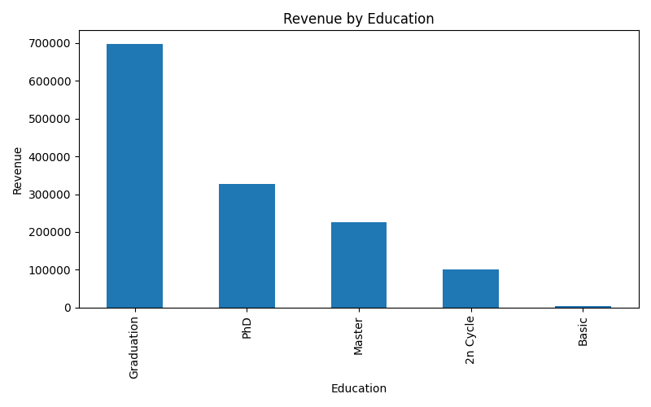
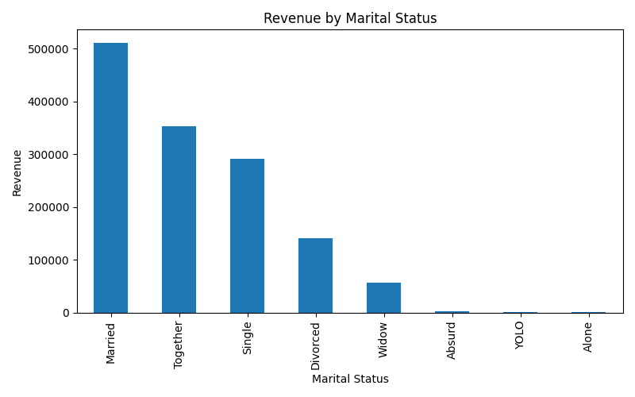
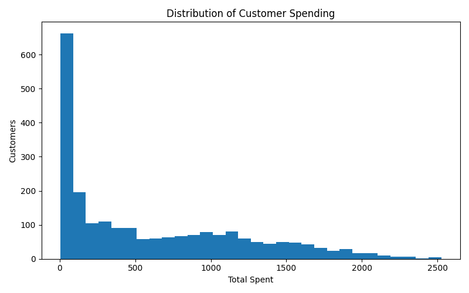
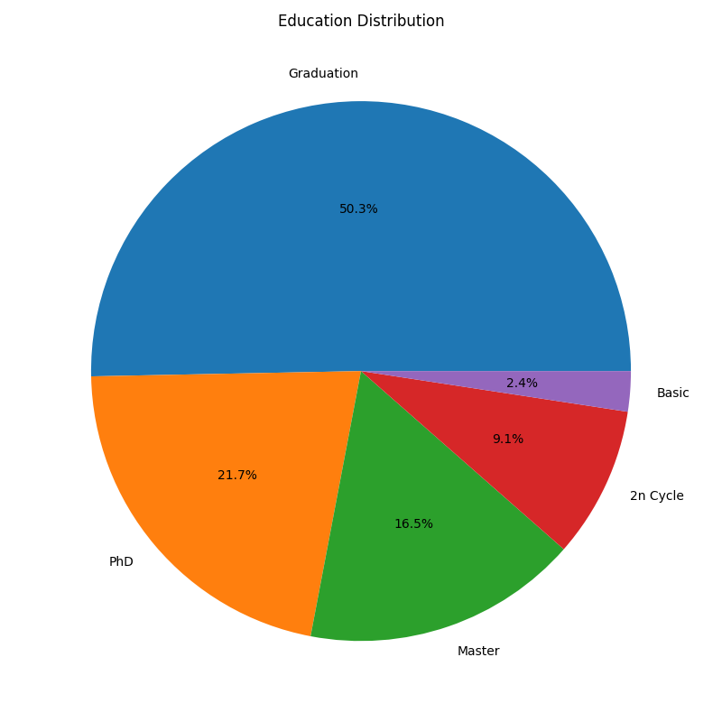
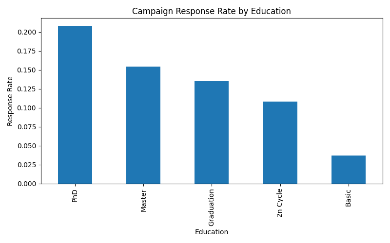

# Business Analytics Report

## Dataset Overview

This analysis was performed on a customer marketing dataset containing 2240 customers.

### Key Metrics

- Total Customers: 2240
- Total Revenue: 1,356,988
- Average Revenue per Customer: 605.80

---

# Revenue Analysis

## Revenue by Education

| Education   |   TotalSpent |
|:------------|-------------:|
| Graduation  |       698626 |
| PhD         |       326791 |
| Master      |       226359 |
| 2n Cycle    |       100795 |
| Basic       |         4417 |

### Insight

Graduation customers generate the highest total revenue.

---

## Revenue by Marital Status

| Marital_Status   |   TotalSpent |
|:-----------------|-------------:|
| Married          |       510453 |
| Together         |       352865 |
| Single           |       291112 |
| Divorced         |       141666 |
| Widow            |        56889 |
| Absurd           |         2385 |
| YOLO             |          848 |
| Alone            |          770 |

### Insight

Married customers generate the highest revenue.

---

# Customer Segmentation

## Average Spending by Education

| Education   |   TotalSpent |
|:------------|-------------:|
| PhD         |     672.409  |
| Graduation  |     619.899  |
| Master      |     611.781  |
| 2n Cycle    |     496.527  |
| Basic       |      81.7963 |

### Insight

PhD customers spend the most per customer.

---

## Average Income by Education

| Education   |   Income |
|:------------|---------:|
| PhD         |  56145.3 |
| Master      |  52917.5 |
| Graduation  |  52720.4 |
| 2n Cycle    |  47633.2 |
| Basic       |  20306.3 |

### Insight

PhD customers have the highest average income.

---

# Marketing Campaign Analysis

## Campaign Response Rate by Education

| Education   |   Response |
|:------------|-----------:|
| PhD         |   0.207819 |
| Master      |   0.154054 |
| Graduation  |   0.134871 |
| 2n Cycle    |   0.108374 |
| Basic       |   0.037037 |

### Insight

PhD customers respond best to campaigns.

---

## Campaign Response Rate by Marital Status

| Marital_Status   |   Response |
|:-----------------|-----------:|
| Absurd           |   0.5      |
| YOLO             |   0.5      |
| Alone            |   0.333333 |
| Widow            |   0.246753 |
| Single           |   0.220833 |
| Divorced         |   0.206897 |
| Married          |   0.113426 |
| Together         |   0.103448 |

### Insight

Widow and Single customers have the strongest campaign response rates among major customer groups.

---

# Top Spending Customers

|    ID |   TotalSpent |
|------:|-------------:|
|  5350 |         2525 |
|  5735 |         2525 |
|  1763 |         2524 |
|  4580 |         2486 |
|  4475 |         2440 |
|  5453 |         2352 |
| 10133 |         2349 |
|  9010 |         2346 |
|  6024 |         2302 |
|  5386 |         2302 |

---

# Key Findings

1. Total customer revenue reached **1,356,988**.
2. Average customer spending was **605.80**.
3. Highest revenue education group: **Graduation**.
4. Highest revenue marital status: **Married**.
5. Highest average spending group: **PhD**.
6. Highest average income group: **PhD**.
7. Best campaign response group: **PhD**.
8. Most common education level: **Graduation**.
9. Most common marital status: **Married**.
10. Highest spending customer spent **2,525**.

---

# Visualizations

## Revenue by Education

## Revenue by Marital Status

## Distribution of Customer Spending

## Education Distribution

## Campaign Response by Education

---

# Recommendations

1. Focus marketing efforts on PhD, Master, and Graduation customers.
2. Develop loyalty programs for high-spending customers.
3. Create specialized campaigns for Single and Widow customers.
4. Increase engagement among low-spending customer segments.
5. Continue customer segmentation analysis to improve campaign effectiveness.
